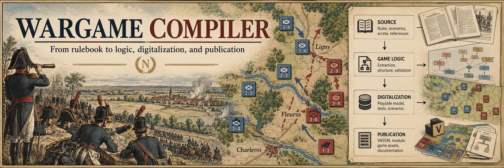

# wargame-compiler



> [!IMPORTANT]
> ## Copyright & Usage Notice
> Wargame Compiler is a tool. It does not grant rights to third-party game content, rulebooks, maps, counters,
> artwork, trademarks, VASSAL modules, or other publisher materials. Use only input materials you are allowed to
> read, analyze, translate, digitize, reproduce, or distribute, and do not use this repository to distribute
> unauthorized copies. Game and publisher names are used only for identification, testing, interoperability,
> research, or documentation; rights remain with their respective owners. This project is not affiliated with or
> endorsed by any publisher unless explicitly stated. See [COPYRIGHT.md](COPYRIGHT.md).

Kontrolowany **kompilator instrukcji gier wojennych**: od PDF-u wydawcy przez kanoniczny model logiki gry do
specyfikacji silnika gry (z testami) oraz do wiernego wydania w innym języku w oprawie oryginału.

```text
SOURCE → Stage 1 LOGIC ──┬──→ Stage 1.5 DIGITALIZATION → engine spec + testy
                         └──→ Stage 2 EDITORIAL → Stage 3 TRANSLATION / PUBLICATION → LaTeX / PDF
```

- **WGC** (pakiet `wgc`): domena: kontrakty, Knowledge Base, walidatory, narzędzia deterministyczne.
- **GLU** (pakiet `glu`): wykonanie: joby, cache i CLI; planowana kolejka wymiany pakietów z aplikacją desktopową.
- **Lokalny LLM:** opcjonalny kontroler przez proces/pliki po pilocie jakości. Dawny projekt `igw` i węzła LAN
  jest odłożony ([ADR-0037](docs/adr/ADR-0037-ekstrakcja-desktop-bez-api.md)).
- Knowledge Base w repo gry jest źródłem prawdy. Repozytorium narzędzia jest pamięcią projektu.

> **Aktualny kierunek (2026-10-06):** przebudowa ingestu PDF przez ChatGPT lub Claude Desktop, bez API inferencji.
> Zachowujemy rdzeń WGC/GLU; lokalny LLM jest opcjonalnym kontrolerem. Plan zapisany, implementacja od M-DESK1.
> Zacznij od [planu implementacji](docs/DESKTOP-IMPLEMENTATION-PLAN.md) i [STATUS](docs/STATUS.md).
> Opisy gatewaya i routingu poniżej odzwierciedlają wcześniejszy projekt, zastąpiony w tym zakresie przez ADR-0037.

Następca narzędzia `wargame_utils` (`wgu`), budowany od zera (ADR-0001). Oba mogą działać obok siebie (ADR-0002).

## Szybki start (deweloper)
```bash
python -m pip install -r requirements.txt pytest
```
```bash
python -m pytest
```

## Dokumentacja
| Dokument | Po co |
|---|---|
| [CLAUDE.md](CLAUDE.md) | bootstrap dla sesji AI |
| [COPYRIGHT.md](COPYRIGHT.md) | polityka third-party content, nazw i wygenerowanych wyników |
| [docs/STATUS.md](docs/STATUS.md) | stan, bieżący i następny milestone, otwarte kwestie |
| [docs/HANDOFF.md](docs/HANDOFF.md) | ostatnie przekazanie pracy |
| [docs/SESSION-PLAYBOOK.md](docs/SESSION-PLAYBOOK.md) | jak prowadzić sesję, role modeli, rozmiar sesji |
| [docs/ROADMAP.md](docs/ROADMAP.md) | aktywne etapy M-DESK i historyczny backlog |
| [docs/DESKTOP-IMPLEMENTATION-PLAN.md](docs/DESKTOP-IMPLEMENTATION-PLAN.md) | przebudowa ingestu, kryteria odbioru i start kolejnej sesji |
| [docs/VISION.md](docs/VISION.md) | wizja i zasady |
| [docs/ARCHAEOLOGY.md](docs/ARCHAEOLOGY.md) | co istniało, lekcje, analiza luk |
| [docs/ARCHITECTURE.md](docs/ARCHITECTURE.md) | warstwy, granica WGC ↔ GLU, repozytoria |
| [docs/PIPELINE.md](docs/PIPELINE.md) | etapy, kontrakty etapów, bramki i statusy, śledzenie |
| [docs/LOGIC-MODEL.md](docs/LOGIC-MODEL.md) | Stage 0/1, Rule IR, provenance, model ryzyka |
| [docs/DIGITALIZATION.md](docs/DIGITALIZATION.md) | Stage 1.5: stan, akcje, legalność, zdarzenia, timing, losowość, testy |
| [docs/EDITORIAL-PUBLICATION.md](docs/EDITORIAL-PUBLICATION.md) | Stage 2 i Stage 3 |
| [docs/GLU.md](docs/GLU.md) | orkiestracja, joby, cache, przyrostowość |
| [docs/INFERENCE-ROUTING.md](docs/INFERENCE-ROUTING.md) | tiery, routing, providerzy, self-hosted inference |
| [docs/inference/NODE.md](docs/inference/NODE.md) | węzeł inferencji, Inference Gateway, profile, scheduler, bezpieczeństwo, awarie |
| [docs/inference/DEPLOYMENT.md](docs/inference/DEPLOYMENT.md) | wdrożenie węzła na Windows 11: sieć, firewall, TLS, autostart, diagnoza |
| [docs/MCP.md](docs/MCP.md) | MCP, Claude Desktop, bezpieczeństwo |
| [docs/DATA-CONTRACTS.md](docs/DATA-CONTRACTS.md) | schematy, ID, hashe, wersjonowanie |
| [docs/QUALITY.md](docs/QUALITY.md) | model jakości, mutacje, benchmarki |
| [docs/COST.md](docs/COST.md) | model kosztu, baseline, obserwowalność |
| [docs/adr/](docs/adr/README.md) | decyzje architektoniczne |
| [docs/DOD-SESSION-0.md](docs/DOD-SESSION-0.md) | spełnienie Definition of Done Session 0 |
| [docs/DOD-M-INF0.md](docs/DOD-M-INF0.md) | spełnienie Definition of Done korekty architektury inferencji |

## Układ repo
```text
contracts/schemas/     JSON Schema kontraktów (wgc/*@0, glu/exec@0, igw/api@0)
contracts/fixtures/    przykłady poprawne (valid/) i niepoprawne (invalid/)
wgc/                   domena (dziś: rejestr kontraktów)
glu/                   wykonanie (pusty do M8)
igw/                   (od M-GW1) Inference Gateway węzła; nie importuje wgc ani glu
bench/minigame/        gra benchmarkowa Drill Skirmish (CC0)
docs/                  dokumentacja, ADR, handoffy
tests/                 testy kontraktów i ciągłości
```

Tłumaczenia i materiały tworzone narzędziem są nieoficjalne. Teksty wydawców nie trafiają do tego repozytorium.
